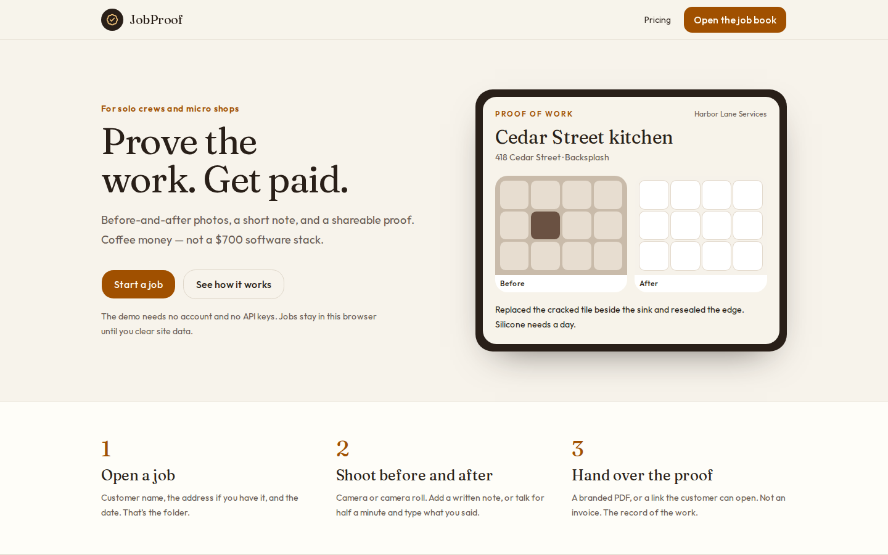
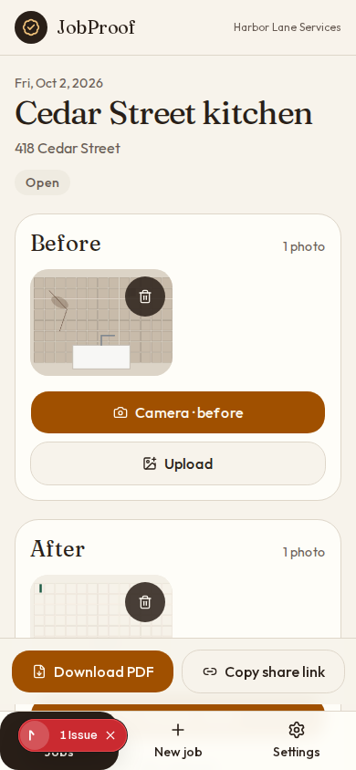

# JobProof

Prove the work and get paid — for coffee money.

JobProof is a mobile-first PWA for solo and micro crews. Open a job, shoot before and after, add a short note (or a voice memo), then hand the customer a branded PDF or a link. It is not a scheduling CRM, a quoting engine, or a GPS fleet tool.

CompanyCam is the photo locker, often about $99 a month. A Jobber-class stack is what contractors describe when the bill lands between $400 and $700 a month. JobProof is the thin piece in the middle: proof of work.

| | JobProof | CompanyCam | Jobber stack |
| --- | --- | --- | --- |
| Price | $19/mo Pro or $99 lifetime Lite | About $99/mo for photos | $400–700/mo reported |
| Before/after proof PDF | Yes, with your company name | Photo library | Needs the rest of the suite |
| Schedule, quotes, fleet | No, on purpose | No | Yes |
| Demo | This browser, no account | Their cloud | Their cloud |

## Demo path

No API keys. No account. `npm install` and `npm run build` do not need secrets.

```bash
npm install
npm run dev
```

Open [http://127.0.0.1:3000](http://127.0.0.1:3000) (or whatever port `next dev` prints).

1. **Open the job book** from the landing page.
2. **Load a sample job** (Cedar Street kitchen) or create one: customer name, optional address, date.
3. On the job, add **Before** and **After** photos. On a phone, Camera opens the camera; Upload picks from the library.
4. Write a note. Optionally record a voice memo. Type the transcript yourself — the demo does not send audio to a speech service.
5. **Download PDF**. The file uses the company name from Settings (default: Harbor Lane Services).
6. **Copy share link** and open `/share/[token]` in the same browser.

Photos, notes, audio, and share snapshots live in IndexedDB on that device. Clearing site data clears the job book. A share link opened on another phone will not find the report; that is demo mode, not a hosted account.

Change the company name under **Settings**. It shows up on the next PDF and share page.

Pricing buttons call Stripe Checkout only when `STRIPE_SECRET_KEY`, `STRIPE_PRICE_PRO`, and `STRIPE_PRICE_LIFETIME` are set (see `.env.example`). Otherwise the UI says checkout is coming soon and the demo keeps working.

## Jev decision aid

Jev (TypeSafe System One) is a text decision API, not a vision model. JobProof still keeps the photos on the device. After you add photos and a note, one request can ask, in parallel, what role each photo plays (`before`, `after`, `detail`, or `irrelevant`), a completeness Score from 1 to 5, whether the set is enough for a customer proof PDF, and — when the job has an address and at least two photos — whether the timestamps look like the same site visit. The screen labels the result **Decision aid** and shows a calibrated confidence when the call succeeded. That number is a probability, not a certainty. It is a check on contractor proof completeness. It does not say the work was done correctly, and it is not a safety or medical determination.

The request sends role labels, pixel size, timestamps, counts, the address, and the note text. It does not send image bytes.

Create a key at [thejevai.com](https://thejevai.com) or in the TypeSafe console at [console.typesafe.ai/keys](https://console.typesafe.ai/keys). Put it in the environment of the Next.js server:

```bash
JEV_API_KEY=...
# TYPESAFE_API_KEY works as a fallback name for the same bearer token
```

The client posts to `https://thejevai.com/v1/systemone` and pins `jev-1.13.0` (`JEV_MODEL` overrides that). OpenRouter also hosts the model (`~typesafe/jev-latest`); this client does not speak the OpenRouter Decisions request shape.

| Variable | Effect |
| --- | --- |
| `JEV_API_KEY` or `TYPESAFE_API_KEY` | Bearer token. With neither set, a local heuristic fills the aid and the demo still runs. |
| `JEV_DUAL_RUN=1` | Call Jev (or the heuristic), log the contractor gate and the aid, and keep the PDF available. |
| `JEV_PRIMARY=1` | A Jev completeness score with calibrated confidence of at least 0.70 can soft-block **Download PDF** when the score is under 3 of 5. The contractor can still **Override**. Below 0.70, the PDF waits for that same person to confirm. A missing key does not soft-block. |
| `JEV_MODEL` | Model id. Default `jev-1.13.0`. |

A failed call, or a missing key with `JEV_PRIMARY=1`, leaves the PDF available. The job stores the probabilities in IndexedDB. A thin proof, or one a person overrode, carries a short decision-aid line on the PDF. That line is a completeness badge, not a claim the job is finished to a trade standard.

Cost is about **$0.042 per million input tokens**, and **$0 for output tokens**. One job sends a short JSON state, on the order of a few hundred tokens, so a call is a fraction of a cent. The bill tracks state size times how often you check a job, not a per-decision fee.

```bash
npm run test:jev
```

## Screenshots

Landing:



A sample job on a phone-sized viewport:



## Scripts

| Command | What it does |
| --- | --- |
| `npm run dev` | Next.js dev server |
| `npm run build` | Production build |
| `npm start` | Serve the production build |
| `npm test` | Vitest: job creation, PDF helper, and the Jev aid |
| `npm run test:jev` | Parser and the no-key heuristic for the Jev decision aid |
| `npm run test:e2e` | Playwright: create a job, attach a photo, download a PDF, open the share page |
| `npm run screenshots` | Rewrite `docs/landing.png` and `docs/job-detail.png` |

Playwright starts the dev server on port 43123 unless one is already running. Install the browser once with `npx playwright install chromium`.

## PWA

The app ships a web manifest and a network-first service worker (`public/sw.js`), registered in production. Install it from the browser. Offline, pages you have already opened can load from cache, and jobs already stored on the device still open. `/offline` is the navigation fallback.

## Stack

Next.js (App Router), TypeScript, Tailwind, shadcn/ui, IndexedDB via `idb`, PDFs via jsPDF. Stripe is optional. Jev is an optional decision aid with a local fallback.
